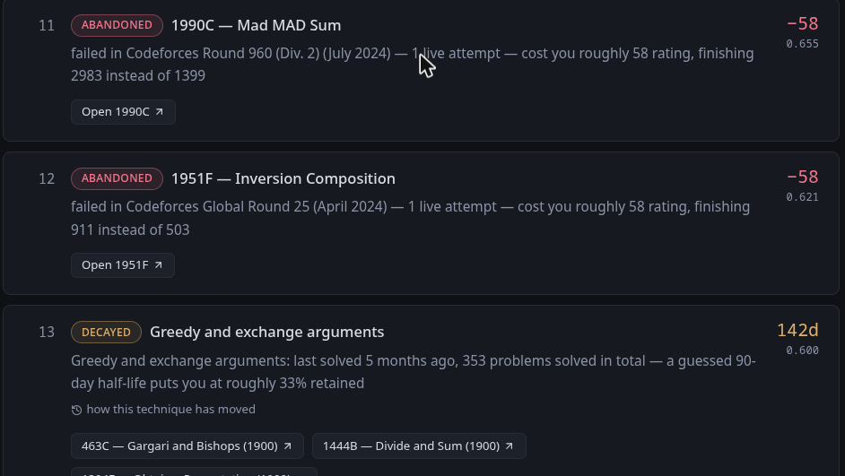
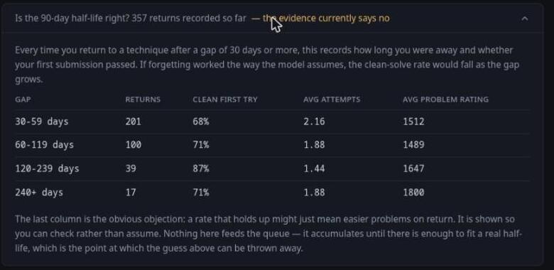

# Practice Debt

Every Codeforces tool asks *which of these 10,000 problems should you solve?*

This one asks *what do you already owe?*



Two kinds of debt:

- **Abandoned** — problems you failed live in a contest and never went back to. Each carries an
  estimate of the rating it cost you, computed from the real ranklist.
- **Decayed** — techniques you built up and then stopped touching. Inferred passively from what you
  already solve; nothing here schedules a review.

Both merge into one ranked list, and every row explains itself.

```bash
docker compose up -d      # http://localhost:8080
```

Self-hosted and single-user by design. See [Running your own copy](#running-your-own-copy), and
[Where every number comes from](#where-every-number-comes-from) if you would rather start by
distrusting it.

## Running your own copy

This is single-user software by design — no accounts, no auth — so everyone
runs their own instance. Fork it, or clone it, and you own the database and the credentials.

### The short way

```bash
docker compose up -d          # database, then the app on http://localhost:8080
```

One image serves both halves: the API, and the page that reads it. There is one user and one
machine, so there is no reason for a second process.

### Development

```bash
docker compose up -d db
cd backend  && mvn spring-boot:run
cd frontend && npm install && npm run dev    # :5173, proxies /api to :8080
```

### Do you need a Codeforces API key?

**Probably not.** If you practise in public contests and the problemset, the anonymous API sees
everything, and the tool works fully without a key.

**You do need one if you practise inside a private gym or group** — a university course, a training
group, a private mashup. Codeforces omits those submissions from unauthenticated responses
*entirely*, with nothing to indicate anything is missing. One account showing 19 solved problems on
its own profile returned 5 to an anonymous call.

```bash
cd backend
cp secrets.properties.example secrets.properties   # then paste your key and secret
```

Generate the pair at [codeforces.com/settings/api](https://codeforces.com/settings/api); the secret
is shown once. `secrets.properties` is gitignored and excluded from the Docker build context, so it
cannot reach a commit or an image. For the container, pass `CODEFORCES_APIKEY` and
`CODEFORCES_APISECRET` as environment variables instead.

A key authorises as **its owner**, not per queried handle — there is no delegation. Your key reveals
your private work and nobody else's, which is exactly why this is self-hosted rather than a service:
a hosted version would have to collect other people's API secrets, which is both an auth system and
a liability.

`GET /api/mirror/status` reports `codeforcesAuthenticated` so you can confirm signing is on, and
startup logs say the same. Neither ever prints the credentials.

### What a key still will not buy

Signing makes `user.status` return private gym submissions, but **`contest.standings` refuses those
contests anyway** — six of seven answered "Contest with id … not found" even when authorised. So
private group contests have no ranklist, no name, and no rating changes here.

Problems from them are still recovered, because every submission carries its problem object, but
they arrive **without tags**. The taxonomy is tag-seeded, so they cannot be classified automatically
and decayed debt will not see them. Pinning them by hand in the taxonomy file is the only route, and
for problems written specially for a group contest it is the only route that will ever exist.

## The API

Startup applies migrations and, if the local problemset copy is older than
`codeforces.mirror.max-age` (12h), refreshes it from Codeforces. A cold start mirrors ~11,400
problems in about two seconds.

```bash
curl localhost:8080/api/mirror/status
curl -X POST localhost:8080/api/mirror/problemset/refresh          # force
curl -X POST localhost:8080/api/mirror/problemset/refresh-if-stale # respect max-age

curl -X POST localhost:8080/api/handles/<handle>/sync              # contests + submissions
curl -X POST localhost:8080/api/handles/<handle>/debt/abandoned/cost   # rating cost per item
curl localhost:8080/api/handles/<handle>/debt/abandoned

curl -X POST localhost:8080/api/taxonomy/apply   # re-read the taxonomy file, remap every problem
curl localhost:8080/api/taxonomy                 # techniques and coverage

curl -X POST localhost:8080/api/handles/<handle>/decay/snapshot   # record where techniques stand
curl localhost:8080/api/handles/<handle>/debt/decayed
curl localhost:8080/api/handles/<handle>/decay/history/tree-dp

curl -X POST localhost:8080/api/handles/<handle>/mirror-missing-contests  # gym and group contests
```

A sync refreshes the contest list, then pulls the handle's whole submission history. For a handle
with ~2,300 submissions this takes about five seconds. Reads never touch Codeforces.

Costing is a separate step because it is expensive: each contest that produced a debt item needs its
whole ranklist (~15 MB) and rating change list (~3.5 MB) mirrored at one request per two seconds,
then two full runs of the rating formula over the field. A first pass over 25 contests took about
two minutes; re-running against the mirror took 14 seconds.

Tests: `cd backend && mvn test`. The unit tests need neither Postgres nor the network; the debt
derivation tests start a `postgres:18-alpine` container via Testcontainers and run the real
migrations against it, so **Docker must be running**.

> Testcontainers is pinned to 1.21.4. The 1.21.2 that Boot 3.5.3 manages ships a docker-java that
> negotiates API version 1.32, which Docker 29 rejects outright (`minimum supported API version
> is 1.40`).

## Where every number comes from

Nothing in this system is learned, fitted, or trained. Every figure is either read from Codeforces,
computed by a published formula, or picked by hand — and the third kind is the one worth arguing
with. Each row links to the section that makes the case for it.

| what | value | where it comes from |
|---|---|---|
| **Abandoned debt** | | |
| what counts as failing live | `CONTESTANT` only | **decision** — [why virtual and out-of-competition are excluded](#abandoned-debt) |
| when the problem is assumed solved | the last live attempt | **decision** — [counterfactual](#rating-cost) |
| wrong attempts assumed | live failures minus one | **decision** — the last submission is the one that passed |
| problem value decay | `X − X·floor(t/60)/250`, floor `0.3X` | **measured** from contest 1993, reproduces 494/940/1236 exactly |
| wrong-attempt cost, scored contests | 50 points | **measured**, same contest |
| wrong-attempt cost, ICPC contests | 10 minutes | **measured** — unanimous across 1,514 rows of contest 1969 |
| compile errors | not an attempt | **measured** — a problem scored full points with one against it |
| rating delta | seed → geometric mean → binary search | **Codeforces' own formula**, reimplemented ([why it is used as a difference](#why-the-rating-model-is-used-as-a-difference)) |
| first-timer seed rating | 1500 | **inferred** — moved exact reproductions of a real contest from 5 to 408 |
| **Decayed debt** | | |
| half-life | 90 days, same for every technique | **guess**, and [the calibration data already disagrees](#the-calibration-signal-is-already-disagreeing-with-the-model) |
| solves before a technique can be "forgotten" | 3 | **guess** — below it, a gap not a debt |
| retention at which it surfaces | 0.5 | **definition** — exactly one half-life |
| gap that counts as a return | 30 days | **guess** — shorter is ordinary practice rhythm |
| what refreshes a technique | accepted submissions only | **decision** — a failed attempt is not evidence it is intact |
| ranking | `solvedCount × (1 − retention)` | **decision** — [and the first version got it backwards](#ranking-and-a-mistake-worth-recording) |
| techniques shown at once | 10 | **decision** — a queue that reports everything reports nothing |
| **Suggestions** | | |
| difficulty anchor | your current rating | **your data** — from `user.rating` |
| anchor when unrated | 1400 | **guess** |
| difficulty band | `anchor − 100` to `anchor + 300` | **guess** — [the suggestion rule](#the-suggestion-rule) |
| ordering | nearest difficulty, then most-solved | **decision** |
| suggestions per technique | 3 | **decision** |
| **The queue** | | |
| decayed vs abandoned | `DECAYED_WEIGHT = 0.6` | **guess**, and the single arbitrary number in the ranking — [ranking policy](#ranking-policy) |
| **Taxonomy** | | |
| technique classes | 33 | **hand-authored** — [taxonomy](#technique-taxonomy) |
| techniques per problem | at most 3 | **decision** |
| **Client** | | |
| gap between requests | 2 seconds | **Codeforces' documented limit** |
| attempts per call | 4, exponential backoff | **decision** |

## Stack

Java 21, Spring Boot 3.5.3, PostgreSQL 18, Flyway, Spring JDBC (`JdbcClient` / `JdbcTemplate`).
No ORM: the workload is a bulk mirror plus analytical queries, and hand-written SQL is easier to
reason about than generated SQL for both.

Flyway is pinned to 11.20.3 — the version Boot 3.5.3 manages (11.7.2) refuses to run against
PostgreSQL 18.

## How the Codeforces client behaves

Verified endpoint shapes and their surprises are in [docs/cf-api-notes.md](docs/cf-api-notes.md).
Two constraints shape the design:

- **Rate limits are per IP, unofficial, and worse during live contests.** All calls go through one
  `RequestPacer` enforcing a process-wide minimum gap (default 2s) with no burst allowance.
  Everything else reads Postgres.
- **A refusal is HTTP 400 carrying a JSON envelope.** The client parses the envelope on any JSON
  response, and splits failures in two: `CodeforcesApiException` (upstream refused; retrying is
  pointless) and `CodeforcesUnavailableException` (no answer arrived; fall back to the last good
  snapshot). The API surfaces these as 502 and 503 respectively.

Mirror refreshes never prevent startup. A stale mirror still answers questions; an application
that refuses to boot answers none.

## Abandoned debt

A problem is abandoned debt for a handle when it was attempted under live-contest participation and
has no accepted submission, ever, in any participation mode. That is an anti-join, and it is written
as one in `AbandonedDebtRepository` rather than reassembled in Java — the invariant *a solved problem
never appears as debt* is a property of that query, so that query is what the tests exercise.

**Participation policy — only `CONTESTANT` counts.** The single named point is
`ParticipationPolicy.liveParticipationTypes()`; every debt query reads it.

- `VIRTUAL` is excluded. A virtual round is practice run under a clock: repeatable at will, costs no
  rating, and counting it would let anyone manufacture debt by starting virtuals they never meant to
  finish.
- `OUT_OF_COMPETITION` is excluded. It happens inside the contest window but unrated, so its rating
  cost is definitionally zero and it would sit at the bottom of the queue forever.

To count virtual participation instead, add `ParticipantType.VIRTUAL` to that set and change this
paragraph. Note that rating cost has no meaning for a virtual attempt, so the ranking policy
would need revisiting too.

An accepted submission in *any* mode — including virtual — still clears the debt. Only the failing
side is policy-gated.

### Verification

Checked against a candidate-master handle (5,638 submissions, 2,701 problems solved):

| check | result |
|---|---|
| debt items reported | 29, plus 3 withheld as unattributable |
| independent recompute straight from the raw API payload | 32 — exactly 29 + 3 |
| debt items that have an accepted submission | **0** |
| problems failed live and solved later, correctly excluded | 155 |

Spot-checked item by item against the raw submission list: `1994E` has 11 `CONTESTANT` wrong
answers and no accepted submission ever, and is reported as "11 live attempts, never solved since".
`2003E1` (5 WA + 1 compile error) and `1942F` (4 WA) likewise. The 3 unattributable items are all
contest `104678`, an auth-gated gym round that `contest.list` does not carry — withheld exactly as
designed.

What this does **not** verify is judgement: whether the expensive items are the ones you
remember being annoyed about. That needs your own rated history, which does not exist yet.

The participation policy turns out to be cheap either way on this profile: counting `VIRTUAL` would
add 3 items and `OUT_OF_COMPETITION` 2, against 29. Worth knowing that the decision is not
load-bearing for queue size — it is a correctness argument, not a volume one.

## Rating cost

Each abandoned item carries an estimate of the rating it cost. The counterfactual: **your last
attempt at the problem passed instead of failing, and nobody else did anything differently.**

The assumptions are stated in `CounterfactualPolicy` and returned with every response, because the
spec requires surfacing them rather than burying them:

- **Solve time** is the moment of the last live attempt. That is a fact from your own
  history, not a guess about how fast a typical solver is.
- **Wrong attempts** are the failures *before* that last one — in this telling the final submission
  is the accepted one, so it is not also a penalty.
- **Everyone else is frozen.** This is wrong, and knowingly so: a better round would have shifted
  the whole ranklist.

Scoring rules were measured, not assumed. On contest 1993 the formula
`max(0.3X, X − X·floor(t/60)/250 − 50w)` reproduces the handle's real scores exactly (494, 940,
1236), and a compile error is verifiably not a wrong attempt. On contest 1969, all 1,514 ranklist
rows carrying wrong attempts imply a penalty of exactly 10 minutes each.

### Why the rating model is used as a difference

`RatingSystem` reimplements the published Codeforces formula. It does **not** reproduce modern
Codeforces: median error is around −12 for established competitors, drifting worse down the
ranklist, and first-time entrants need rules that are not documented anywhere. Seeding newcomers
(reported as `oldRating: 0`) at 1500 moved exact reproductions of one real contest from 5 to 408,
which is the empirical case for that being the value Codeforces uses.

So the model is never used as an absolute predictor. A cost is the **difference between two runs
over the same field** — you at your real rank, and at the rank you would have reached — so
a bias afflicting both cancels. Every stored cost keeps `modelActualDelta` beside `actualDelta` so
that assumption stays checkable rather than becoming folklore.

### Verification

Same handle, 29 abandoned items — 22 costed, 7 in unrated contests:

| check | result |
|---|---|
| total rating owed | 1,670 across 22 items, range 6 to 175 |
| costs that were negative | **0** |
| items where the counterfactual rank was *worse* | **0** |
| model reproduced the real delta within ±10 | 17 of 22 |
| worst model error | −159, on a contest where that handle was rated 358 and gained 228 |

Worked example, contest 1993 problem D: 2,670 points and rank 923 actually; solving D at the last
attempt (minute 118, four earlier failures standing) is worth 856 points, giving 3,526 and rank
**429**. The model gives +64 at the real rank against Codeforces' real +67, and +112 at the
counterfactual rank — a cost of **48**.

The model is least trustworthy for young, low-rated accounts, where Codeforces amplifies changes in
undocumented ways: that −159 outlier is one. Its item costs 12, so it barely affects the ranking,
but the pattern is real and `modelError` is stored per item so it can be seen rather than guessed at.

What is still unverified is judgement — whether the expensive items are the ones you actually
regret. That needs your own rated history.

## The queue

The single output of the whole system. Both debt sources merge into one ranked list, and every row
carries a reason naming its source:

```
 1  ABANDONED  1917F — Construct Tree                    −175   1.000
    failed in Codeforces Round 917 (Div. 2) (December 2023) — 4 live attempts
    — cost you roughly 175 rating, finishing 2165 instead of 176

13  DECAYED    Greedy and exchange arguments             141d   0.600
    last solved 5 months ago, 353 problems solved in total — a guessed 90-day
    half-life puts you at roughly 34% retained
    → 463C Gargari and Bishops (1900) · 1444B Divide and Sum (1900)
```

### Ranking policy

The spec calls this the central unresolved design decision, and it is right that there is no correct
answer. It lives at one named point, `QueuePolicy`.

The two sources cannot share a scale honestly. An abandoned item's cost is computed from real
standings and a real rating formula; a decayed technique's urgency rests on a half-life this tool's
own calibration data already disagrees with. Converting one into the other would mean inventing a
second guess to disguise the first.

So each source ranks its own items — abandoned by rating cost, decayed by skill at risk — and that
position becomes a percentile in [0, 1]. Decayed items are then multiplied by
**`DECAYED_WEIGHT = 0.6`**.

That keeps both sources permanently visible while saying plainly that a measurement outranks an
inference. The alternative considered was strict tiering, every abandoned item above every decayed
one: epistemically cleaner, but with 29 abandoned items it buries half the product where nobody
would ever scroll. The weight is the single arbitrary number in the ranking, and there is no
principled value for it — only a defensible one. Raise it toward 1.0 to treat forgetting as
seriously as losing rating.

## Technique taxonomy

Codeforces tags are too coarse to reason about forgetting. `dp` covers 2,526 problems in the mirror
and spans knapsack, tree DP, bitmask DP, digit DP and interval DP. "Your dp is stale" is not a
sentence worth reading.

The taxonomy lives in
[`backend/src/main/resources/taxonomy/techniques-v1.yaml`](backend/src/main/resources/taxonomy/techniques-v1.yaml)
— data in the repository, not constants in code, so it can be argued with and its history kept.
`POST /api/taxonomy/apply` re-reads it and remaps the whole problemset; re-applying is deterministic
(verified by hashing the mapping before and after).

### Tags seed the mapping; they are not the mapping

The proof is in the mirror. These are all digit-DP problems, and no tag combination separates them
from ordinary DP:

| problem | name | tags |
|---|---|---|
| 55D | Beautiful numbers | `dp, number theory` |
| 908G | New Year and Original Order | `dp, math` |
| 1036C | Classy Numbers | `combinatorics, dp` |
| 1073E | Segment Sum | `bitmasks, combinatorics, dp, math` |

There is no `digit dp` tag and there never will be. Meanwhile *Digital Village* (2021E1–E3) is a
tree problem that any name-matching heuristic would misfile as digit DP. So each technique carries:

- **`rules`** — tag and rating patterns that seed the mapping, most specific technique first
- **`whenUnclaimed: true`** — marks a fallback that only takes what nothing more specific wanted
- **`pinned`** — hand-curated assignments that always win. This is where judgement no rule can
  express is recorded, and it is how `digit-dp`, `interval-dp` and `sqrt-decomposition` exist at all
- **`excluded`** — problems a technique must never claim, overriding its own rules

### Coverage

33 techniques across 8 families. Applied to 11,422 mirrored problems: **17,277 assignments, 95.7%
of problems mapped**, capped at three techniques per problem. The unmapped are Codeforces' own
`*special` marker (204, carries no information), problems tagged only `brute force` below the
threshold that class requires (48), and problems with no tags at all (232, of which 52 are gym
problems, which never carry tags) — all left unmapped rather than guessed at.

Two flaws were caught by looking at the coverage table rather than by any test. A first attempt at a
`prefix-sums` rule claimed 2,224 problems at an average rating of 1062 — that is not "prefix sums",
it is "easy problems", and shipping it would have made decay confidently wrong. And `prefix-sums` was
ordered after a broader fallback that ate everything it wanted, leaving it with zero. Both are fixed;
both are the reason the coverage endpoint exists.

### Why it stops at 33 rather than 30

The spec asks for roughly 25–30 classes. v1 had 34; one merge brought it to 33, and the remaining
four candidates were rejected on inspection.

**Merged:** `string-basics` into `implementation-and-simulation`. Both meant the same thing — the
difficulty is writing it carefully, not finding the idea — and their populations agreed: 200 problems
averaging 1111 rating against 627 averaging 1144. Harder string work still goes to the string classes,
which match first.

**Rejected**, because each pair is two things you can have one of and not the other:

- `bit-manipulation` vs `bitmask-dp` — XOR bases and tries over bits is not DP over subsets
- `string-hashing` vs `string-matching-and-automata` — polynomial hashing is not KMP or suffix automata
- `graph-traversal` vs `graph-connectivity` — BFS and DFS is not SCC, bridges and 2-SAT

The tiny classes look like obvious merge candidates and are the opposite. `digit-dp` (7 problems),
`interval-dp` (5) and `sqrt-decomposition` (5) are small because they are pin-only, and they are
exactly the granularity that matters, given `dp` spanning 2,526 problems tells you
nothing. Merging them would defeat the file's purpose to hit a number. "Roughly 25–30" reads as
guidance about granularity rather than a quota, and 33 serves that better than 30 reached by
blurring real distinctions.

**The pin lists are still thin** — those three classes hold 17 problems between them. They grow by
hand, and your sense of where the boundaries fall matters more than mine.

## Decayed debt

Techniques solved before and not touched since. **Entirely passive**: freshness is read off work the
author was going to do anyway, and nothing here schedules a review. Re-solving a problem costs
30–60 minutes, a system that demands that gets ignored, and an ignored system produces meaningless
data.

Only accepted submissions count as touching a technique — a failed attempt is not evidence the
technique is intact. Practised techniques never appear at all; only quiet ones surface.

The suggested action is always a **different** problem in that technique, near your rating.
Never a re-solve: that tests memory of one solution, not command of a technique, at identical cost.

### The suggestion rule

There is no recommender here, and deliberately so — recommending from the global problemset by
rating band is an explicit non-goal, because ladders already do it. A suggestion is only ever an
answer to "what do I do about *this* item". It is one SQL query:

```sql
select ... from problem p
  join problem_technique pt using (contest_id, problem_index)
 where pt.technique_id = :technique
   and p.rating between :anchor - 100 and :anchor + 300
   and not exists (your accepted submission for this problem)
 order by abs(p.rating - :anchor), p.solved_count desc
 limit 3
```

- **The anchor** is your current rating, read from `user.rating` — the newest contest that changed
  it. With no rated contests at all it falls back to 1400, which is a guess made only so that
  suggestions are possible rather than absent.
- **The band, `−100` to `+300`**, aims slightly above comfort: low enough to be solvable after a
  lapse, high enough to be worth the hour. Both numbers are hand-picked.
- **The ordering** takes the nearest difficulty first, breaking ties by how many people have solved
  the problem — a well-trodden problem over an obscure one, since the point is to exercise the
  technique, not to fight the statement.
- **Never a problem you have solved**, in any mode.

A technique with nothing to suggest says so in its reason string rather than appearing actionable
and then offering nothing. That happens when a technique's mapped problems all sit outside your
band, which is common for the pin-only classes.

All the numbers live in `DecayPolicy` and every one is a guess, labelled as such wherever it
surfaces: a **90-day half-life identical for every technique**, at least **3 solves** before a
technique can be called forgotten rather than never learned, and a **30-day gap** before a return
counts as evidence.

### Ranking, and a mistake worth recording

Items are ranked by **skill at risk** — `solvedCount × (1 − retention)`, roughly how many problems'
worth of accumulated skill has decayed.

The first version ranked by staleness alone. On a real profile that put `sqrt-decomposition`
(3 solves, barely learned) at the top and buried `greedy-and-exchange` (353 solves) — precisely
backwards. It also surfaced 30 of 34 techniques, because someone away for a year has technically
forgotten everything, and a queue that reports everything reports nothing. Now at most 10 surface
and the rest are counted as `withheld`.

### The calibration signal is already disagreeing with the model

Every return to a technique after a 30-day gap is recorded: how long the gap was, and whether the
first submission passed. It is derivable retrospectively, so one sync yields years of evidence
rather than starting from zero. **Nothing reads it to make a decision**, and nothing should until
there is enough of it.



For the reference handle, 376 returns:

| gap | returns | clean first try | avg attempts | avg problem rating |
|---|---|---|---|---|
| 30–59 days | 216 | 69% | 2.11 | 1472 |
| 60–119 days | 100 | 70% | 1.91 | 1481 |
| 120–239 days | 42 | 86% | 1.43 | 1624 |
| 240+ days | 18 | 72% | 1.83 | 1744 |

The clean-solve rate does not fall as the gap grows. The obvious explanation would be that longer
gaps mean easier problems on return — so average problem rating is reported alongside, and it
*rises* with the gap. The confound points the other way: after longer breaks this handle attempted
harder problems and solved them cleanly more often.

That is evidence against the 90-day half-life, produced by the tool's own instrumentation, in its
first run. It is not yet conclusive — the long buckets hold 42 and 18 observations, and choosing to
return at all is a selection effect. But it is exactly why there is no fitted decay model
before the data exists, and it is why `technique_snapshot` records the half-life in force with every
row: changing the guess later must not silently rewrite what was already observed.

### Scope: contest debt, not coursework

The tool is about debt incurred in *contests* — problems failed under a live clock, and techniques
built up over time and then left alone. Practice inside a private group or university gym is
deliberately at the edge of that.

It is not an arbitrary boundary. Gym rounds are unrated, so an abandoned gym problem has a rating
cost of exactly zero and would sit at the bottom of the queue forever. Their contests cannot be
named, so an item from one cannot satisfy the rule that a reason names its contest. And their
problems carry no tags, so nothing can classify them without hand curation.

That is the honest position: if your practice is mostly coursework in a private group, this tool
will have little to say until your rated practice grows. Recording the boundary here rather than
quietly returning an empty queue.

### Known limitation

Problem identity is `(contestId, index)`, which is how Codeforces keys it. Div. 1 and Div. 2 rounds
that share a problem expose it under two different contest ids, so failing the Div. 1 copy live and
later solving the Div. 2 copy in practice would leave the item in the queue. Matching on problem
name would fix it and has not been done; flagged here rather than left to be discovered.

Live failures whose contest is not in the mirror — gym rounds, which never appear in `contest.list` —
cannot name their contest and so cannot satisfy the reason-string invariant. They are excluded from
the queue and reported separately as `unattributable`, so the exclusion is visible rather than a
silently shorter list.

### What the public API cannot see

`user.status` returns only submissions to contests a public viewer could open. Submissions inside
**private gym or group contests are omitted entirely** — no error, no marker, they simply are not
there. Confirmed by hand: an account showing 19 solved problems on its own profile returned 5
submissions across 2 problems to the anonymous API, and the missing ones were all in gyms `267312`
and `435607`, both of which answer `Contest with id ... not found` when asked anonymously.

This is a ceiling on what this tool can ever know. It does not affect abandoned debt, which concerns
rated rounds that are public by construction. It matters a great deal for **decayed debt**: for
someone who practises mostly inside a private group, freshness would be inferred from a small
fraction of their real activity and would be confidently wrong. Authenticating the client with a
Codeforces API key (`apiKey`/`apiSig`) is the available fix and is not implemented.

## Schema so far

- `problem` — the mirrored problemset, keyed `(contest_id, problem_index)` the way Codeforces keys
  it. Upserted, never truncated: `first_mirrored_at` is the only record of when a problem entered
  the mirror and a reload would destroy it.
- `contest` — every non-gym contest. Cheap to mirror and load-bearing: a debt item's reason string
  must name its contest.
- `submission` — one handle's history. `handle` is stored lowercase, since Codeforces handles are
  case-insensitive. Every sync refetches the whole history rather than only what is new, because
  verdicts are not immutable: hacks, rejudges and plagiarism sweeps rewrite old ones.
- `mirror_run` — one row per fetch attempt. This is not logging. Decay is a function of elapsed
  time, so *when data arrived* is part of the data.

## Where machine learning could help — and where it would not

Nothing in this system is learned today. That is a deliberate starting point, not an aversion: the
rule is that a model belongs only where the honest answer is currently *a guess labelled as a
guess*. Everywhere [the table above](#where-every-number-comes-from) says **measured** or
**Codeforces' own formula**, a model would add error and remove auditability in exchange for
nothing.

**Worth it: classifying problems into techniques.** The real machine-learning-shaped problem here.
Tags are too coarse and provably cannot express `digit-dp`; a model reading the problem statement
can. The pin lists are already labelled data. One hard constraint: `problem_technique.source`
distinguishes `PINNED` from `RULE`, and a model would add `MODEL`, ranked below both and carrying a
confidence — a hand pin always wins, and every assignment stays traceable. An item whose only
explanation is "a model said so" breaks the rule that an item must explain itself.

**Worth it: fitting the decay half-life.** This is precisely what `technique_return` is accumulating
for: instrumenting the calibration signal from day one. Each row is
`(gap_days, problem_rating, solved_first_try, attempts)` — logistic regression or survival analysis,
not anything exotic, replacing a hand-picked 90 with a fitted number.

Two warnings for whoever tries it. The data already shows clean-solve rate *rising* with the gap, so
a naive fit returns a negative decay rate: the confounders — harder problems chosen on return, and
the selection effect of choosing to return at all — have to be modelled or the result is nonsense.
And a few hundred returns supports fitting **one** parameter, not one per technique.

**Marginal: correcting the rating model.** `rating_change` holds every participant's rank,
pre-contest rating and real delta — hundreds of thousands of labelled rows. Regressing the model's
residual would fix the newcomer blind spot behind the −159 outlier. Tractable, but the cost is
already a difference between two runs of the same model, which cancels most of that bias, so the
payoff is small.

**Blocked, but the signal is nearly free.** `DECAYED_WEIGHT` cannot be learned without knowing
whether items get acted on, and nothing is tracked. But syncs already refetch submissions, so the
system can tell whether a suggested problem was solved within N days of being suggested — implicit
feedback at no extra cost, which is what learning-to-rank would need. The obvious risk is that it
learns to suggest whatever you would have done anyway.

**Theatre:** abandoned debt (set logic, exact), the scoring formulas (measured, exact), rank
recomputation (arithmetic). Anything whose answer is a fact rather than a prediction.

## Open decisions

Recorded here rather than settled quietly in code. Each needs an answer before the milestone that
depends on it.

- **Counterfactual solve time** — at what timestamp is the unsolved problem assumed to have
  been solved when recomputing rank? Affects both penalty and score.
- **Cross-source ranking** — how an abandoned item ranks against a decayed technique. There is no
  correct answer; what matters is that the policy lives at one named point in the code and is
  stated here.
